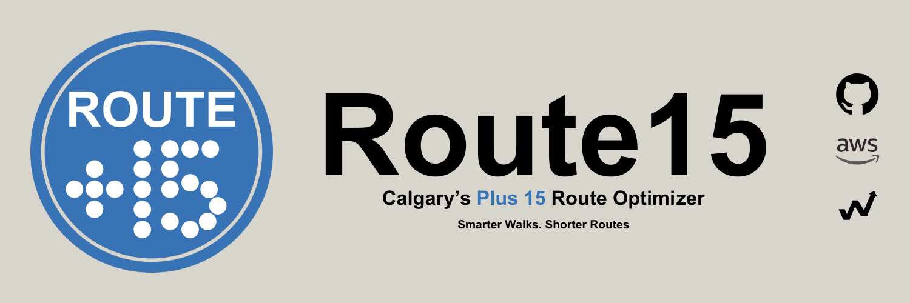

Route 15 Optimizer is your smart navigator for Calgary’s downtown +15 skywalk network. Built to streamline how you move through the city. Whether you're commuting, exploring, or escaping the cold, Route 15 finds the fastest indoor path between any two points.

With a crisp interface and intelligent routing engine, it removes guesswork from the +15 system. Every walkway, bridge, and connection is mapped, optimized, and simplified, so you get where you need to go, faster.

No detours. No confusion. Just smarter steps.
